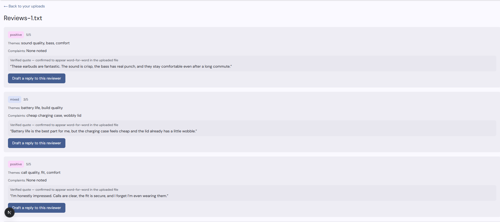

# AI Review Analysis System

An AI-powered customer review analysis system built with Next.js, TypeScript, PostgreSQL and DeepSeek.

The application accepts customer review files, processes them asynchronously through a background worker, uses an AI model to extract structured insights, validates the model output before trusting it, and stores the results for review.

The focus of this project is not simply calling an AI API. It explores how to make AI-generated output reliable enough for an application to use.

## Preview



## What It Does

- Accepts customer review file uploads
- Creates background processing jobs
- Processes AI workloads outside the request lifecycle
- Integrates DeepSeek through its OpenAI-compatible API
- Extracts structured information from customer reviews
- Validates AI responses before storing results
- Verifies extracted quotes against the uploaded source
- Retries selected failures within a controlled retry budget
- Limits concurrent AI processing
- Tracks job states from pending to processing, done or failed
- Stores model responses and processing metadata
- Tracks token usage across attempts
- Provides safe user-facing failure messages
- Supports authenticated access to user jobs and results

## Why Background Jobs?

AI processing can take significantly longer than a normal web request.

Instead of keeping an HTTP request open while waiting for the model, an upload creates a job that can be processed separately by a worker.

```text
Upload
   ↓
Create Job
   ↓
Pending
   ↓
Background Worker
   ↓
DeepSeek
   ↓
Validate Output
   ↓
Store Results
   ↓
Done / Failed
```

This keeps the web application responsive while allowing AI work to be processed independently.

## Reliable AI Output

One of the main engineering problems in the project is that valid JSON does not automatically mean valid application data.

The model response passes through validation before it becomes trusted application data.

The system checks the expected structure and also verifies extracted quotes against the original uploaded review content.

If validation fails, the job can retry within a controlled attempt budget rather than silently accepting unreliable output.

## Worker Design

The AI worker runs as a separate process:

```bash
npm run worker
```

The worker:

1. Finds pending jobs.
2. Claims work using a conditional database update.
3. Respects a concurrency limit.
4. Reads the uploaded review file.
5. Sends the content to the AI provider.
6. Stores provider-response information where appropriate.
7. Validates the structured response.
8. Retries eligible failures within the configured budget.
9. Stores validated results.
10. Marks the job as completed or failed.

Conditional job claiming helps prevent multiple workers from processing the same pending job simultaneously.

## Job States

Jobs move through four primary states:

```text
pending → processing → done
                     ↘ failed
```

The UI reports the real persisted state rather than assuming that a long-running operation has succeeded or failed.

Long-running processing can also be identified separately so the interface can explain when a job may be stuck.

## Tech Stack

- Next.js
- TypeScript
- React
- PostgreSQL
- Prisma
- DeepSeek
- OpenAI-compatible SDK
- Zod
- Node.js
- Tailwind CSS

## Architecture

```text
app/
├── api/
│   ├── auth/            # Authentication endpoints
│   ├── jobs/            # Job state
│   ├── results/         # Analysis results
│   └── upload/          # Review uploads
│
├── upload/              # Upload and processing UI
└── (auth)/              # Authentication flows

lib/
├── ai/                  # AI configuration and validation
├── auth/                # Authentication and sessions
├── jobs.ts              # Job state logic
├── storage.ts           # Uploaded-file handling
└── failure-messages.ts  # Safe user-facing errors

worker/
└── index.ts             # Background AI processor

prisma/
├── schema.prisma
└── migrations/
```

## Failure Handling

AI integrations can fail in several different ways: provider errors, timeouts, malformed responses or responses that are structurally valid but fail application validation.

The worker distinguishes between failures that may be worth retrying and failures where repeating the same request is unlikely to help.

Raw provider errors are not exposed directly to users. The application maps internal failures to safer, actionable messages.

## Running Locally

Clone the repository:

```bash
git clone https://github.com/ScrappyAT/reviewslice.git
cd reviewslice
npm install
```

Copy the environment template:

```bash
cp .env.example .env
```

Configure:

```env
DATABASE_URL=
DEEPSEEK_API_KEY=
```

Start the local PostgreSQL environment as configured by the project, then apply the database migrations:

```bash
npx prisma migrate dev
```

Start the web application:

```bash
npm run dev
```

In another terminal, start the background worker:

```bash
npm run worker
```

## Testing

Run the automated tests with:

```bash
npm test
```

## Environment Variables

See [`.env.example`](./.env.example) for the expected local configuration.

The DeepSeek API key should be supplied through the local environment and should never be committed to the repository.

## Engineering Documentation

Detailed implementation notes, design decisions and assessment evidence are available in:

[DOCUMENTATION.md](./DOCUMENTATION.md)

Additional provider research and implementation notes are available under the [`DOC`](./DOC) directory.

## What I Learned

The biggest lesson from this project was that integrating an AI model is only one part of building an AI-powered product.

The harder engineering problems appear around the model: asynchronous processing, concurrency, retries, validation, failure handling, persistence and deciding when model-generated data is trustworthy enough for the rest of the application to use.

Structured output makes AI responses easier to process, but application-level validation is still necessary before treating those responses as reliable data.

## Project Context

Built as part of my Product Design & Engineering Bootcamp work, with a focus on AI product engineering, background processing and reliable model integration.
